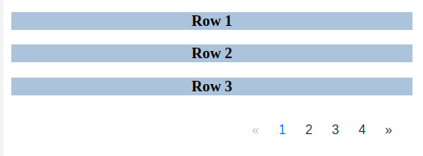

# Pagination-cp

A library to add pagination to your data. It is very simple and easy to use.



## Installation
Use the node package manager [npm](https://www.npmjs.com/) to install pagination-cp
```
npm install --save pagination-cp
```

Or download the .zip and include file from dist folder dist/index.js

```html
<script type="text/javascript" src="index.js"></script></body>
```

## Usage
JavaScript
```
let pagination = new Pagination();
page.getPagination({options});
```
For ES6 add following line
```ecmascript 6
import Pagination from 'pagination-cp'
```
## Examples

Prerequisite: 
1. `tableId` => An id of div wrapping your rows and pagination ul
2. `rowClass` => A common class to all rows 
3. an unordered empty list with classname `pagination`.

You can refer dist/index.html for full example.
 
 ```html
<body>
<div id="page-table">
    <div>
        <div class="page-rows"><h3>Row 1</h3></div>
        <div class="page-rows"><h3>Row 2</h3></div>
        <div class="page-rows"><h3>Row 3</h3></div>
        <div class="page-rows"><h3>Row 4</h3></div>
        <div class="page-rows"><h3>Row 5</h3></div>
        <div class="page-rows"><h3>Row 6</h3></div>
        <div class="page-rows"><h3>Row 7</h3></div>
        <div class="page-rows"><h3>Row 8</h3></div>
        <div class="page-rows"><h3>Row 9</h3></div>
        <div class="page-rows"><h3>Row 10</h3></div>
        <div class="page-rows"><h3>Row 11</h3></div>
        <div class="page-rows"><h3>Row 12</h3></div>
    </div>
    <ul class="pagination">
    </ul>
</div>
</body>
```
#### Default pagination:

```javascript
pagination.getPagination({
    tableId: 'page-table',
    rowClass: 'page-rows',
    maxRows: 10  //default 5
});
```
#### Show first and last buttons:

```javascript
pagination.getPagination({
    tableId: 'page-table',
    rowClass: 'page-rows',
    maxRows: 5,
    showFirstBtn: true,
    showLastBtn: true,
});
```
#### Without Previous and next buttons:

```javascript
pagination.getPagination({
    tableId: 'page-table',
    rowClass: 'page-rows',
    maxRows: 5,
    showFirstBtn: true,
    showLastBtn: true,
    showPreviousBtn: false,
    showNextBtn: false,
});
```

#### with border:

```html
<ul class="pagination pagination-bordered">
</ul>
```
## Options
```
tableId         => required  => An id of div wrapping your rows and pagination ul

rowClass        => required  => A common class to all rows

maxRows         => optional  => maximum no. of rows/items per page, (default 5)

showFirstBtn    => optional  => to show First button (default false)

showLastBtn     => optional  => to show Last button (default false)

showPreviousBtn => optional  => to show Previous button (default true)

showNextBtn     => optional  => to show Next button (default true)

```

# Thank You!