# Pagination-cp

A plugin to add pagination to your data. It is very simple and easy to use with many customizable options.
It supports simple to standard pagination UI and available in multiple colors.

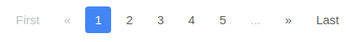


## Installation
Use the node package manager [npm](https://www.npmjs.com/) to install pagination-cp
```
npm install --save pagination-cp
```

Or download the .zip and include file from dist folder dist/index.js

```html
<script type="text/javascript" src="index.js"></script>
```

## Examples

Prerequisite: 
1. `tableId` => An id of div wrapping your rows and pagination ul
2. `rowClass` => A common class to all rows 
3. an unordered empty list with classname `pagination`.

Refer dist/index.html for full example.
 
 ```html
<body>
<div id="page-table">
    <table class="tftable">
            <tr>
                <th>Header 1</th>
                <th>Header 2</th>
            </tr>
            <tr class="page-rows">
                <td>Row:1 Cell:1</td>
                <td>Row:1 Cell:2</td>
            </tr>
            <tr class="page-rows">
                <td>Row:2 Cell:1</td>
                <td>Row:2 Cell:2</td>
            </tr>
            .
            .
            .
            <tr class="page-rows">
                <td>Row:2 Cell:1</td>
                <td>Row:2 Cell:2</td>
            </tr>
    </table>
    <ul class="pagination">
    </ul>
</div>
</body>
```

## Usage

JavaScript
```
let pagination = new Pagination();
page.getPagination({options});
```
For ES6 add following line
```
import Pagination from 'pagination-cp'
```

### JS

#### Default pagination:
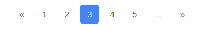
```javascript
pagination.getPagination({
    tableId: 'page-table',
    rowClass: 'page-rows',
    maxRows: 5
});
```

#### Different Themes:
```javascript
pagination.getPagination({
    tableId: 'page-table',
    rowClass: 'page-rows',
    maxRows: 5,
    theme: 'basic'
});
```

| Theme option | UI |
| --- | :---: |
| micro| 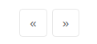 |
| mini | 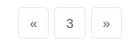 |
| basic| 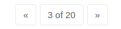 |
| standard|  |

#### Show first and last buttons:

```javascript
pagination.getPagination({
    tableId: 'page-table',
    rowClass: 'page-rows',
    maxRows: 5,
    firstBtn: {
        display: true,
        label: 'First'
    },
    lastBtn: {
        display: true,
        label: 'Last'
    }
});
```

#### Without Previous and next buttons:
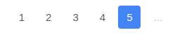
```javascript
pagination.getPagination({
    tableId: 'page-table',
    rowClass: 'page-rows',
    maxRows: 5,
    previousBtn: {
        display: false
    },
    nextBtn: {
        display: false
    }
});
```

#### Always show Fist and Last Page number:
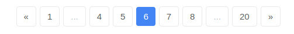
```javascript
pagination.getPagination({
    tableId: 'page-table',
    rowClass: 'page-rows',
    maxRows: 5,
    showFirstPageNum: true,
    showLastPageNum: true,
});
```

#### Add Go To Page:
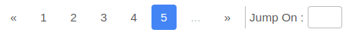
```javascript
pagination.getPagination({
    tableId: "page-table",
    rowClass: "page-rows",
    maxRows: 5,
    goToPageBtn: {
        display: true,
        label: 'Jump On'
    }
});
```

### CSS

#### With Border:
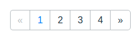

Add class `pagination-bordered` to ul tag
```html
<ul class="pagination pagination-bordered">
</ul>
```

#### Circular Page Items:
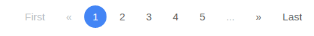

Add class `circular` to ul tag
```html
<ul class="pagination circular">
</ul>
```

#### Apply colors:
Add class `color--<color-name>` to ul tag
```html
<ul class="pagination color--green">
</ul>
```

Available colors

| Color | Value | UI |
| ----- | ----- | :-----: |
| color--green | #2abbac | 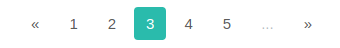 |
| color--red | #fb3548 | 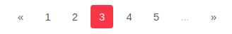 |
| color--blue | #4385f5 | 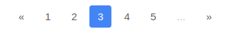 |
| color--orange | #fa6f01 | 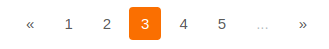 |
| color--dark | #2e2e2e | 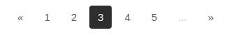 |
| color--purple | #5d35b0 | 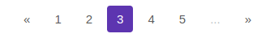 |

## Options

| Option | Sub-Option | Type | Required? | Default | Description |
| :--- | --- | --- | --- | :---: | --- |
| tableId | - | String | Required | - | An id of div wrapping all rows and pagination ul element|
| rowClass | - | String | Required | - | A common class to all rows|
| maxRows | - | Integer | Optional | 5 | Maximum number of rows/items per page|
| theme | - | String | Optional | standard | Different themes for pagination. Theme options are `mini`, `micro`, `basic`, `standard`. Below Pagination options (except goToPageBtn) work only for `standard` theme. |
| firstBtn | display | Boolean | Optional | false | Show first button|
|  | label | String | Optional | First | Custom Label for first button|
| lastBtn | display | Boolean | Optional | false | Show Last button|
|  | label | String | Optional | Last | Custom Label for last button|
| previousBtn | display | Boolean | Optional | true | Show previous button|
|  | label | String | Optional | `<<` | Custom Label for previous button|
| nextBtn | display | Boolean | Optional | true | Show next button|
|  | label | String | Optional | `>>` | Custom Label for next button|
| goToPageBtn | display | Boolean | Optional | false | Show Go To Page Input|
|  | label | String | Optional | Go To Page | Custom Label for Go To Page Input|
| showFirstPageNum | - | Boolean | Optional | false | Always show first page number|
| showLastPageNum | - | Boolean | Optional | false | Always show last page number|

## Feedback
For issues or suggestions please see [pagination-cp](https://github.com/captainpauu/pagination-cp) on Github.
Thank You for your support!
